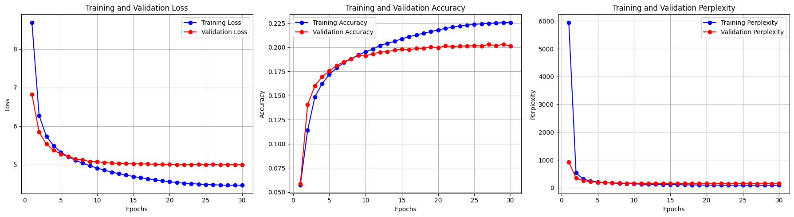
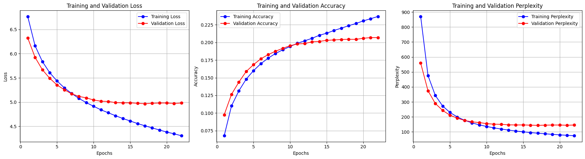

# GPT-Forge: A From-Scratch Transformer for Text Generation


<div align="center">


</div>

This repository showcases my from-scratch implementation of a GPT-style (decoder-only) Transformer model in PyTorch. I built this project to gain a fundamental, first-principles understanding of the architecture that powers modern Large Language Models. The entire pipeline—from data preprocessing to autoregressive inference—is engineered for clarity, modularity, and reproducibility.

---

## 🎯 Key Achievements

* **Engineered a GPT-style Transformer from the Ground Up:** I implemented the core components of a decoder-only Transformer, including multi-head self-attention with causal masking, positional embeddings, and feed-forward layers, using pure PyTorch to solidify my understanding of the model's internal mechanics.
* **Built a Complete End-to-End ML Pipeline:** I designed and developed a robust pipeline covering data ingestion, text cleaning, tokenization, a custom `DataLoader` for efficient batching, and a flexible training and evaluation engine with checkpointing.
* **Conducted Systematic Experimentation:** I systematically trained and evaluated two models of different scales (~22M and ~52M parameters) to validate the impact of model capacity on performance, tracking key metrics like loss and perplexity.
* **Developed a Text Generation Interface:** I created an inference module to generate coherent text autoregressively from a given prompt, demonstrating the model's practical language modeling capabilities.

---

## 📈 Performance & Results

To validate the model's learning capabilities and the impact of scaling, I trained two versions and compared their performance on the IMDB dataset. As hypothesized, the larger model achieved superior results, confirming its enhanced capacity to model the data distribution.

*All experiments were conducted on an NVIDIA A10G GPU.*

### Experiment 1: Baseline Model (22M Parameters)
* **Architecture**: 2 layers, 4 attention heads, 256 embedding dimensions.
* **Best Validation Loss**: `4.991`
* **Best Validation Perplexity**: `147.07`



### Experiment 2: Scaled Model (52M Parameters)
* **Architecture**: 4 layers, 8 attention heads, 512 embedding dimensions.
* **Best Validation Loss**: `4.967`
* **Best Validation Perplexity**: `143.55`



### Results Summary
Scaling up the model's parameters directly resulted in improved performance, showcasing a successful implementation of a scalable Transformer architecture.

| Metric                 | Experiment 1 (Baseline) | Experiment 2 (Larger Model) |
| :--------------------- | :---------------------- | :-------------------------- |
| **Embedding Size** | 256                     | **512** |
| **Num Layers** | 2                       | **4** |
| **Num Heads** | 4                       | **8** |
| **Total Parameters** | ~22M                    | **~52M** |
| **Best Validation Loss**| 4.991                   | **4.967** |
| **Best Validation PPL** | 147.07                  | **143.55** |

---

### ✍️ Text Generation Showcase

Below are unedited text samples generated by the 52M parameter model.

**Prompt 1:**
> "I think this movie was"

**Generated Text:**
> "i think this movie was a bit too much for me but i was pleasantly surprised by the acting and the story line i was disappointed with the movie the plot was pretty weak and the acting was pretty good but the story was pretty weak and the plot was weak the plot was weak and the acting was pretty good but the movie was a little too long and the plot was pretty much a little too much to"

---

**Prompt 2:**
> "The plot was full of holes and the characters were"

**Generated Text:**
> "the plot was full of holes and the characters were so underdeveloped that they were not even close to the original story the plot was so weak and the acting was so bad that i couldnt care less about the characters and the plot was so bad that i couldnt care less about the characters and the plot was so"

---

## 🛠️ Tech Stack & Core Concepts

This project demonstrates my proficiency in the following areas:

* **Languages & Frameworks:** Python, PyTorch, NumPy
* **Transformer Architecture:** Multi-Head Self-Attention, Positional Encodings, Layer Normalization, Feed-Forward Networks.
* **NLP Concepts:** Autoregressive Generation, Causal & Padding Masking, Tokenization, Vocabulary Building.
* **ML Engineering:** Modular Code Design, Custom DataLoaders, End-to-End Training Loops, GPU Acceleration, Model Checkpointing, Experiment Tracking.

---

## 🚀 Getting Started

Follow these steps to set up the environment and run the project on your local machine.

### 1. Clone the Repository & Set Up Environment
It is recommended to use a virtual environment.
```bash
git clone https://github.com/nabeelshan78/GPT-Forge-from-scratch-transformer-text-generation.git
cd GPT-Forge-from-scratch-transformer-text-generation

python -m venv venv
source venv/bin/activate  # On Windows: venv\Scripts\activate
pip install -r requirements.txt
```

### 2. Prepare the Data
Download the IMDB dataset (e.g., using torchtext) and place it as data/imdb_dataset.pt. Then, run the preparation script to process the data and build the vocabulary.
```bash
python scripts/prepare_data.py
```

### 3. Train a Model
The training and experiment logic is contained in the notebooks. To kick off a training run, execute the cells in:
* `notebooks/01_experiment_baseline_model.ipynb`
* `notebooks/02_experiment_scaled_model.ipynb`

Logs and model checkpoints will be saved to the `runs/` directory.

---

### 4. Generate Text (Inference)
Use the following Python script to generate text with a trained model. Remember to update `MODEL_PATH` to your checkpoint file.

```python
import torch
from src.model import CustomGPTModel
from src.utils import generate_text
from src.config import tokenizer, BLOCK_SIZE, DEVICE

# --- Configuration ---
VOCAB_PATH = "artifacts/vocab.pth"
MODEL_PATH = "runs/epoch_1_20_v2/best_model.pth" # <-- Point to your best model checkpoint
MODEL_CONFIG = {
    "embed_size": 512,
    "num_heads": 8,
    "num_layers": 4,
    "dropout": 0.15,
}

# --- Load Model and Vocabulary ---
vocab = torch.load(VOCAB_PATH)
model = CustomGPTModel(
    vocab_size=len(vocab),
    max_seq_len=BLOCK_SIZE,
    **MODEL_CONFIG
).to(DEVICE)
model.load_state_dict(torch.load(MODEL_PATH, map_location=DEVICE))
model.eval()
print("✅ Model and vocabulary loaded successfully!")

# --- Generate Text ---
prompt = "This is one of the best films I have ever seen."
generated_text = generate_text(
    model=model,
    prompt=prompt,
    tokenizer=tokenizer,
    vocab=vocab,
    block_size=BLOCK_SIZE,
    max_new_tokens=50,
    device=DEVICE
)

print("-" * 50)
print(f"Prompt: '{prompt}'")
print(f"Generated Text: '{generated_text}'")
print("-" * 50)

```
> Note: A CUDA-enabled GPU is highly recommended for training. The code will automatically use an available GPU.
---

### 5. 📂 Project Architecture
I organized the repository to follow modern ML engineering best practices, ensuring a clean separation of concerns.
```
GPT-Forge-from-scratch-transformer-text-generation/
├── data/                  # Raw and processed datasets
├── images/                # Visuals for README
├── notebooks/             # Jupyter notebooks for experiments
├── runs/                  # Saved models, logs, and checkpoints
├── scripts/               # Standalone scripts (e.g., data prep)
├── src/                   # Main source code
│   ├── config.py          # Hyperparameters and constants
│   ├── dataloader.py      # Custom data loading logic
│   ├── engine.py          # Training and evaluation loops
│   ├── model.py           # Core CustomGPTModel class
│   └── utils.py           # Helper functions
├── README.md              # You are here!
└── requirements.txt       # Project dependencies
```

---

