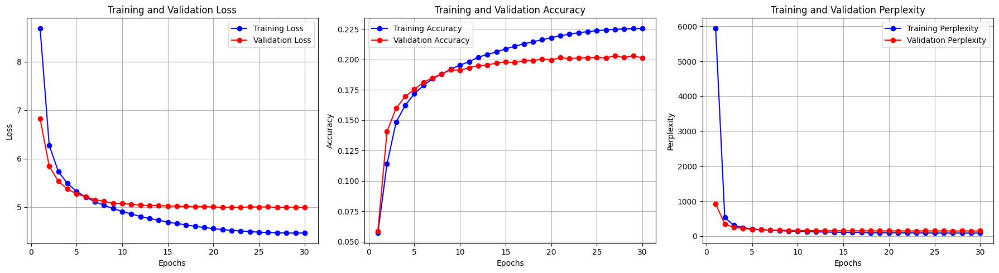
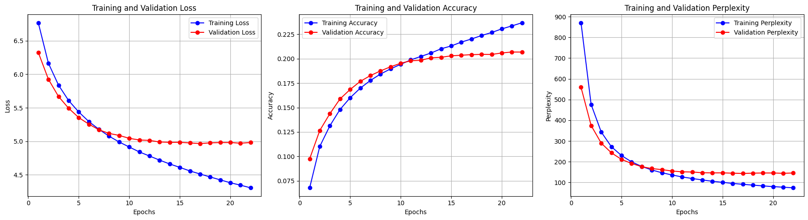

# 🤖 GPT-from-Scratch: A PyTorch Implementation


This repository contains a complete, from-scratch implementation of a GPT-style (decoder-only) Transformer model for autoregressive text generation. The model is built entirely in **PyTorch**, trained on the **IMDB movie review dataset**, and structured as a modular and reproducible machine learning project.

The primary goal of this project was to build a deep, hands-on understanding of the internal mechanics of the Transformer architecture, which powers modern Large Language Models.

---

## ✨ Key Features

* **Modular Codebase:** A well-organized and decoupled source directory (`src/`) that separates data handling, model architecture, training engine, and utilities for clarity and scalability.
* **Custom Transformer Model:** A custom GPT model built using PyTorch's `nn.TransformerEncoderLayer`, demonstrating a deep understanding of core components.
* **Complete ML Pipeline:** A full end-to-end pipeline covering:
    * 🧹 **Data Preparation:** Robust text cleaning and processing.
    * 📦 **Custom Dataloader:** Efficient batching and padding.
    * 🚀 **Training & Evaluation Engine:** A comprehensive training loop with metrics tracking (Loss, Accuracy, Perplexity), model checkpointing, and logging.
    * ✍️ **Text Generation:** Inference script to generate text from a given prompt using a trained model.
* **Experiment Tracking:** Systematic tracking of two distinct experiments with different hyperparameters, with results logged and visualized.

---

## 📊 Results and Performance

Two primary experiments were conducted to analyze the impact of model size and learning rate schedulers.

### Experiment 1: Baseline Model with OneCycleLR

* **Model:** 2 layers, 2 heads, 256 embedding dimensions.
* **Scheduler:** `OneCycleLR` for dynamic learning rate adjustment.
* **Best Validation Loss:** `4.991`
* **Best Validation Accuracy:** `20.32%`



### Experiment 2: Larger Model with Constant LR

* **Model:** 4 layers, 8 heads, 512 embedding dimensions (~52M parameters).
* **Scheduler:** Constant Learning Rate.
* **Best Validation Loss:** `4.967`
* **Best Validation Accuracy:** `20.68%`



### Performance Comparison

| Metric                  | Experiment 1 (Baseline) | Experiment 2 (Larger Model) |
| ----------------------- | ----------------------- | --------------------------- |
| **Embedding Size** | 256                     | 512                         |
| **Num Layers** | 2                       | 4                           |
| **Num Heads** | 2                       | 8                           |
| **Total Parameters** | ~13M                    | ~52M                        |
| **Scheduler** | OneCycleLR              | Constant LR                 |
| **Best Validation Loss**| **4.991** | **4.967** |
| **Best Validation Acc.**| **20.32%** | **20.68%** |

### ✍️ Text Generation Showcase

Here are some examples of text generated by the best-performing model (from Experiment 2) given a prompt.

**Prompt 1:**
> "I think this movie was"

**Generated Text:**
> "i think this movie was a bit too much for me but i was pleasantly surprised by the acting and the story line i was disappointed with the movie the plot was pretty weak and the acting was pretty good but the story was pretty weak and the plot was weak the plot was weak and the acting was pretty good but the movie was a little too long and the plot was pretty much a little too much to"

---

**Prompt 2:**
> "The plot was full of holes and the characters were"

**Generated Text:**
> "the plot was full of holes and the characters were so underdeveloped that they were not even close to the original story the plot was so weak and the acting was so bad that i couldnt care less about the characters and the plot was so bad that i couldnt care less about the characters and the plot was so"

---

## 🔧 Setup and Usage

Follow these steps to set up the environment and run the project.

### 1. Clone the Repository
```bash
git clone [https://github.com/](https://github.com/)<your-username>/gpt.git
cd gpt
```

### 2. Create Environment and Install Dependencies
It is recommended to use a virtual environment.
```bash
python -m venv venv
source venv/bin/activate  # On Windows, use `venv\Scripts\activate`
pip install -r requirements.txt
```
*(A `requirements.txt` file should be created with the following content:)*
```
torch==2.2.0
torchtext==0.17.2
torchdata==0.7.1
transformers==4.35.2
matplotlib
tqdm
seaborn
```

### 3. Prepare the Data
First, you need to download the IMDB dataset. The `prepare_data.py` script assumes you have a `data/imdb_dataset.pt` file. You can create this with a simple script using `torchtext`.

Once the raw data is in place, run the preparation script:
```bash
python scripts/prepare_data.py
```
This will clean the text, create a new 80/10/10 train-validation-test split, build a vocabulary, and save the processed files to `data/` and `artifacts/`.

### 4. Training
The training pipelines and experiments are detailed in the Jupyter notebooks. To train the model, open and run the cells in:
- `notebooks/exp1.ipynb`
- `notebooks/exp2.ipynb`

All logs, checkpoints, and the best model for each experiment will be saved in the `runs/` directory.

### 5. Inference
To generate text using a trained model, you can use a simple script like the one below. Make sure to point to the correct vocabulary and model checkpoint paths.

```python
import torch
from src.model import CustomGPTModel
from src.utils import generate_text
from src.config import tokenizer, BLOCK_SIZE, DEVICE

# --- 1. Load Vocabulary and Model ---
VOCAB_PATH = "artifacts/vocab.pth"
MODEL_PATH = "runs/epoch_1_20_v2/best_model.pth" # Path to your best model

vocab = torch.load(VOCAB_PATH)
VOCAB_SIZE = len(vocab)

# Re-create the model architecture
model = CustomGPTModel(
    vocab_size=VOCAB_SIZE,
    embed_size=512,  # Use params from the corresponding experiment
    num_heads=8,
    num_layers=4,
    dropout=0.15,
    max_seq_len=BLOCK_SIZE
).to(DEVICE)

# Load the trained weights
model.load_state_dict(torch.load(MODEL_PATH, map_location=DEVICE))
print("Model and vocabulary loaded successfully!")

# --- 2. Generate Text ---
prompt = "This is one of the best films I have ever seen."
generated_text = generate_text(
    model=model,
    prompt=prompt,
    tokenizer=tokenizer,
    vocab=vocab,
    block_size=BLOCK_SIZE,
    max_new_tokens=50,
    device=DEVICE
)

print("-" * 50)
print(f"Prompt: '{prompt}'")
print(f"Generated Text: '{generated_text}'")
print("-" * 50)
```

---

## 🏛️ Project Structure

The repository is organized to maintain a clean and scalable project structure.

```
gpt/
│
├── data/
│   ├── imdb_dataset.pt         # Raw data (user must provide)
│   └── processed_data.pkl      # Processed train/val/test splits
│
├── images/
│   ├── plot_exp_1.png          # Training history plots for Experiment 1
│   └── plot_exp_2.png          # Training history plots for Experiment 2
│
├── notebooks/
│   ├── initial_notebook.ipynb  # Initial exploration and prototyping
│   ├── exp1.ipynb              # End-to-end notebook for Experiment 1
│   └── exp2.ipynb              # End-to-end notebook for Experiment 2
│
├── runs/
│   ├── epoch_1_30/             # Logs and models for Experiment 1
│   │   ├── best_model.pth
│   │   └── training.log
│   └── epoch_1_20_v2/          # Logs and models for Experiment 2
│       ├── best_model.pth
│       └── training.log
│
├── scripts/
│   └── prepare_data.py         # Script for data cleaning and preprocessing
│
├── src/
│   ├── config.py               # Hyperparameters and project constants
│   ├── dataloader.py           # Data loading and collation logic
│   ├── engine.py               # Training and evaluation loops
│   ├── model.py                # Main CustomGPTModel class
│   ├── modules.py              # Sub-modules (PositionalEncoding, TokenEmbedding)
│   └── utils.py                # Helper functions (text generation, logging)
│
├── .gitignore
└── README.md
```

---

## 🧠 Core Concepts Implemented

This project serves as a practical demonstration of several core concepts in Transformer models:

-   **Token and Positional Embeddings:** Creating input representations that capture both semantic meaning and sequence order.
-   **Self-Attention Mechanism:** The core of the Transformer, allowing the model to weigh the importance of different tokens in a sequence.
-   **Causal (Look-ahead) Masking:** Ensuring the model can only attend to previous tokens during training, which is crucial for autoregressive generation.
-   **Padding Masking:** Teaching the model to ignore padding tokens in batched sequences.
-   **Stacking Transformer Layers:** Building a deep model by stacking multiple `TransformerEncoder` blocks.
-   **Autoregressive Inference:** Generating text one token at a time by feeding the model's own output back as input.

---

## 🚀 Future Improvements

-   **Implement Advanced Sampling:** Add sampling strategies like **Top-k**, **Top-p (Nucleus)**, and **temperature scaling** for more diverse and creative text generation.
-   **Larger Dataset:** Train the model on a larger, more diverse corpus like OpenWebText to improve coherence and general knowledge.
-   **CLI Interface:** Develop a command-line interface for easier training and inference without needing to run notebooks.
-   **Architectural Enhancements:** Experiment with different activation functions (GeLU) and normalization layers (LayerNorm).

---

## 📜 License
This project is licensed under the MIT License. See the `LICENSE` file for details.
